# Decoding Directorial Style: Using Pose and Action Estimation to Analyze Theater Performances

<!-- .slide: data-background-video="assets/vis_fondly_phalp_coco.mp4" -->
<!-- .slide: data-background-size="contain" -->
<!-- .slide: data-background-video-loop -->
<!-- .slide: class="main-title" -->

---

## Introductions

 Michael Rau

 Peter Broadwell

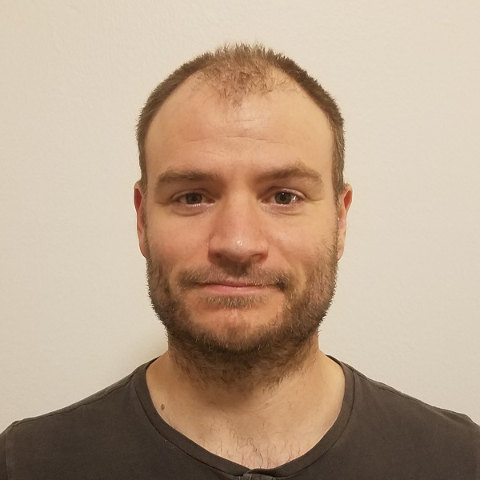 Simon Wiles

 Vijoy Abraham

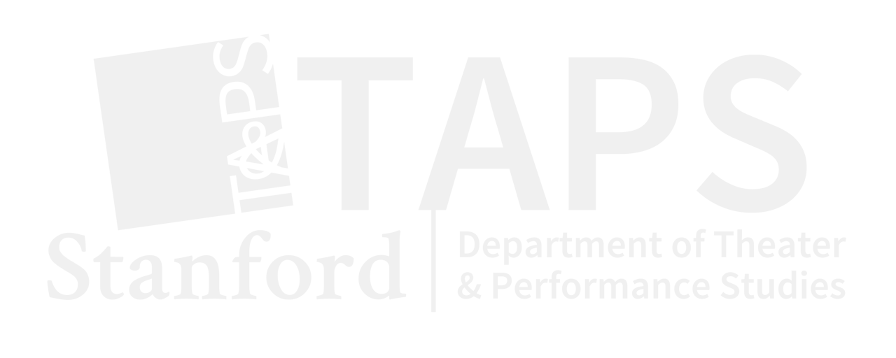

:::
Hello and thank you for joining us today. My name is Vijoy Abraham and I am the Head of the Center for Interdisciplinary Digital Research, part of Research Data Services unit at the Stanford Libraries. I’ll be introducing our topic, and project team.

Today’s presentation comes from the field of cultural analytics, whereby computational methods are applied to the study of cultural heritage. We will discuss and demonstrate our exploratory work in bringing machine learning techniques to the study of theater performance and, in particular, to the study of directorial style.

The project, titled Machine Intelligence for Motion Exegesis, is the result of a collaboration between Assistant Professor Michael Rau, and the CIDR Developer Team at Research Data Services. That team consists of Peter Broadwell and Simon Wiles.

Michael Rau is Assistant Professor of Theater and Performance Studies as well as an affiliate faculty member at HAI here at Stanford University. He has directed works internationally including plays, operas, and digital media projects and has been featured in the New York Times, the Guardian and the Telegraph, and was the recipient of a 2021 Artists + Machine Intelligence Research Award from Google. He received an MFA in Directing from Columbia University.

Peter Broadwell is a Digital Scholarship Research Developer at the Stanford University Libraries’ Center for Interdisciplinary Digital Research, where his work applies machine learning, web-based visualization, and other methods of digital analysis to complex cultural data. He has a Ph.D. in Musicology from the University of California, Los Angeles and an M.S. degree in Computer Science from the University of California, Berkeley.

Simon Wiles is our other Digital Scholarship Research Developer. Top notch fellow.

This project is part of a long-running service at the Stanford Libraries where faculty are invited to engage with our team in exploring computational methods for analyzing, visualizing, and allowing for interactive exploration of their research. We have at times referred to these projects as Lighthouse Projects- our hope being that our collaborations are able to expose new pathways for scholarly inquiry that would only be possible through such long-term engagements and the provisioning of dedicated technical resources.

I’ll ask Michael to come up now and share the project’s problem statement.

---

## The Problem: Understanding Pose in Theater

## Methodology: Models and Tools

## Building the MIME Platform (Demo)

## Results and Analysis

## Implications and Future Directions

---

# The Problem

:::
Pose and staging lies at the intersection of authorial intent, directorial vision, and is mediated by the performer, and shaped by design choices.  Examining pose and staging in theater can be tricky since it sits at the heart of artistic expression in the theater, and now, we’re adding computational analysis. At its core, our problem revolves around a fundamental question: How can we quantify and analyze the physical arrangements and movements of actors on stage in a way that reveals something meaningful about the director's creative contribution?

In traditional theater studies, the concept of pose is often taken for granted. Directors, performers and audiences intuitively understand the power of a well-crafted tableau or a precisely choreographed sequence of movements.  In theater, iconic poses or choreography can define productions, like Brecht’s silent scream choreography in Mother Courage, or Bob Fosse’s shoulder roll and arm pops in The Pajama Game or the collective poses of the ensemble in "A Chorus Line.” These production’s indelible poses helped make the work memorable, and are a signature of a particular director’s contribution to the production, and serve as a shorthand for identifying a director’s style.

However, these individual, memorable poses are just the tip of the iceberg. Our challenge lies in understanding the aggregate effect of all poses throughout a production, and even more ambitiously, across multiple productions by the same director. This is where we begin to approach the notion of a director's signature or style.

In film studies, auteur theory provides a framework for understanding a director's unique imprint on their work. Film directors have a range of tools at their disposal – camera angles, editing techniques, lighting choices – that make their stylistic signatures more readily apparent. In theater, however, the director's expressive capabilities are more constrained, and their contribution can be more elusive to pin down. In the theater, a director is constrained more by the physical space that they’re staging in, and the fact that their work happens in real-time, by live actors,who mediate the director’s staging.

This is where the computational analysis of pose in theater becomes interesting. By leveraging technologies like pose estimation and action recognition, we can begin to quantify aspects of theatrical performance that were previously left to subjective interpretation. We can analyze not just individual poses, but patterns of movement, spatial relationships between performers, and even the rhythm and flow of a production.

The question that you might be asking yourself, is “A purely data-driven analysis might pick up on patterns and consistencies in a director's work, but can it capture the nuanced, thematic use of pose that a trained theater scholar might recognize immediately?” This is the delicate balance we must strike. On one hand, we have the potential to uncover patterns and stylistic elements that might not be apparent to the naked eye, especially when analyzing a director's body of work as a whole. On the other hand, we risk reducing the rich, complex art of theater direction to a series of data points.

Our solution lies in a synthesis of approaches. By combining the insights of traditional theater scholarship with the analytical power of computational methods, we can begin to develop a more comprehensive understanding of pose in theater. We can use data to support and enhance our qualitative analyses, and we can use our human understanding of theatrical context to guide our interpretation of the data.

Ultimately, the problem of pose in theater is not just about understanding physical arrangements on stage. It's about decoding the language of movement that directors use to communicate their artistic vision. It's about recognizing patterns across productions that might reveal deeper truths about a director's style or preoccupations. And perhaps most excitingly, it's about opening up new avenues for creativity and analysis in the world of theater.

---

## The Problem (and Opportunity)

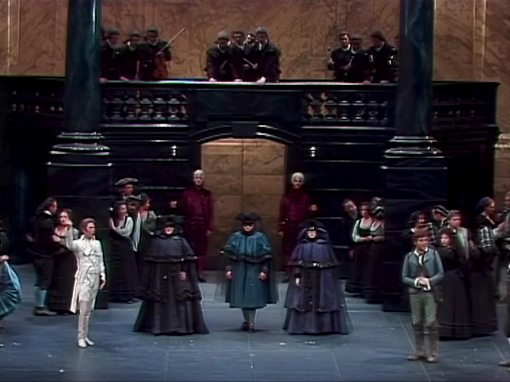

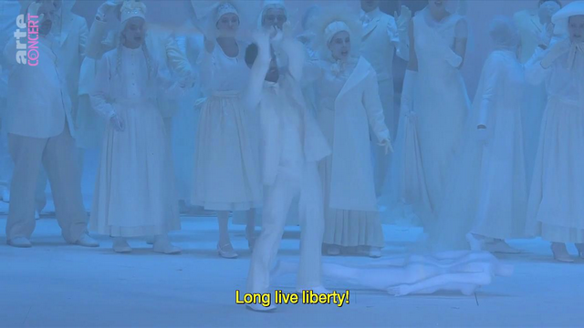

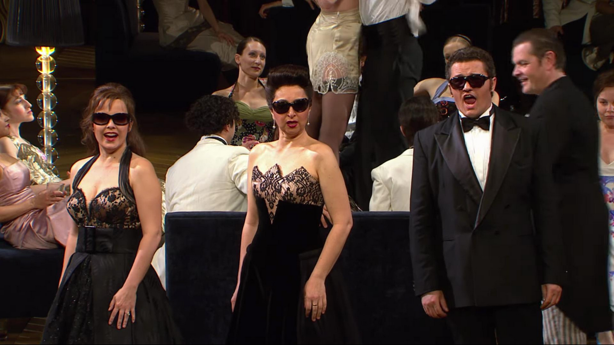

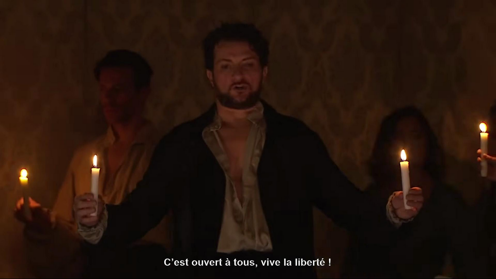

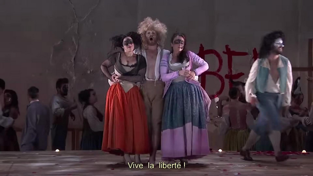

<!-- .slide: data-transition="slide-in fade-out" -->

---

## The Problem (and Opportunity)

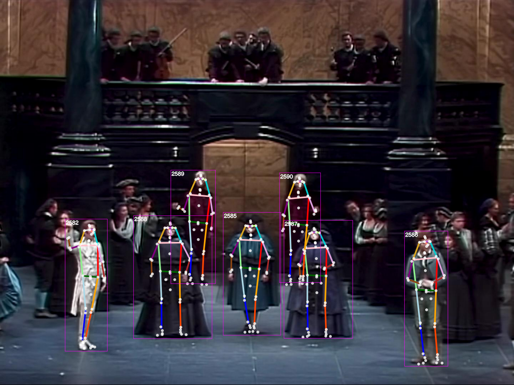

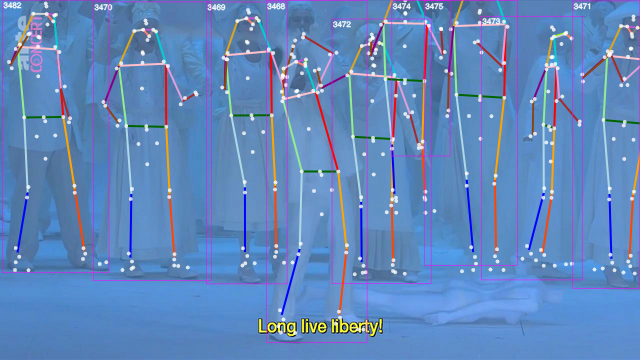

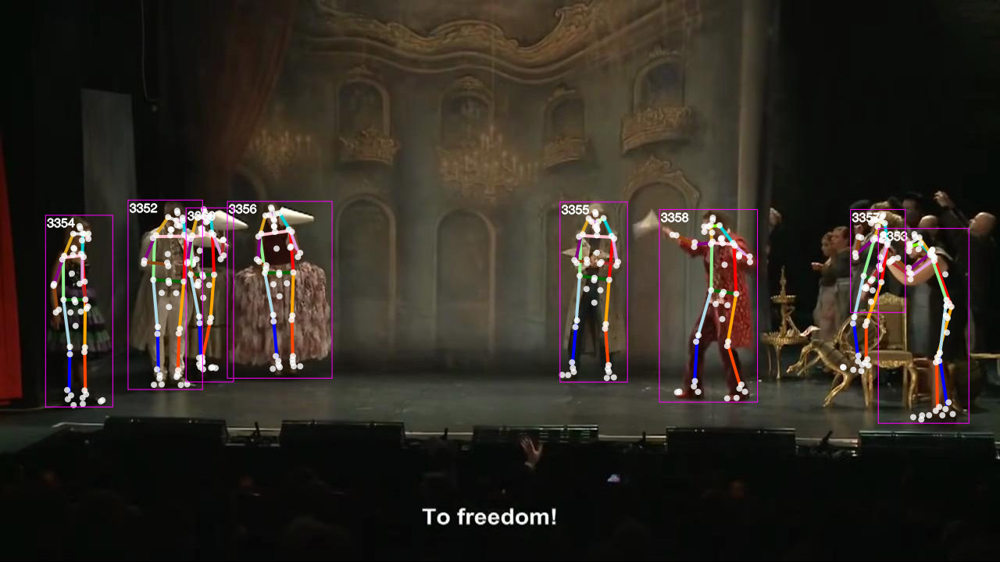

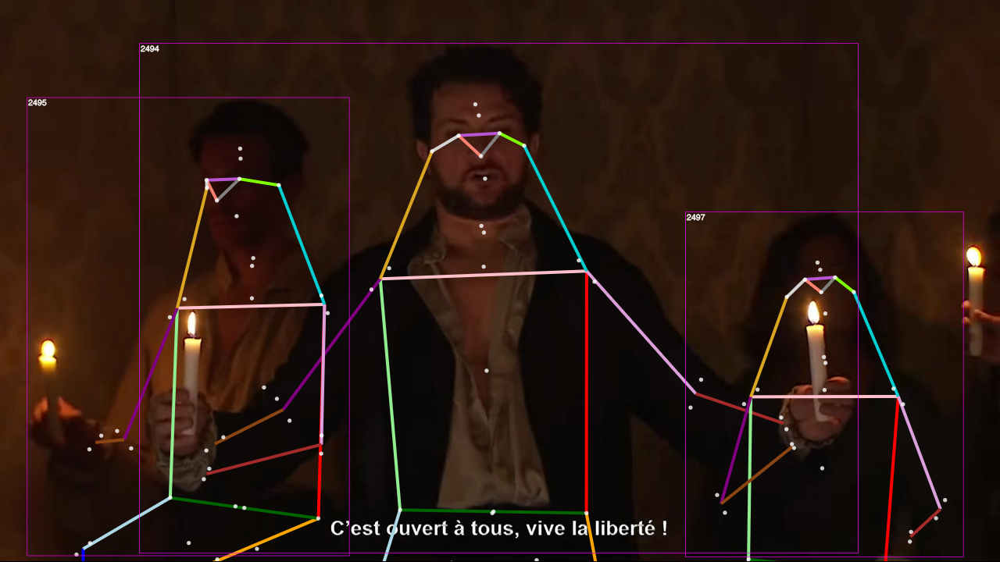

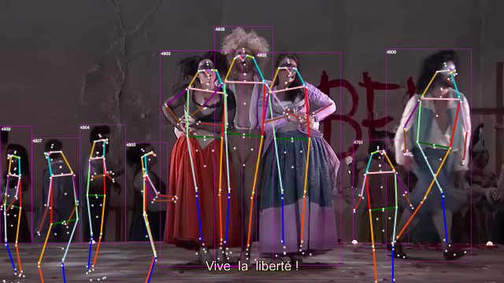

<!-- .slide: data-transition="fade-in slide-out" -->

---

# Methodology

---

## A Breakthrough: Temporal-Convolutional vs. Transformer Models

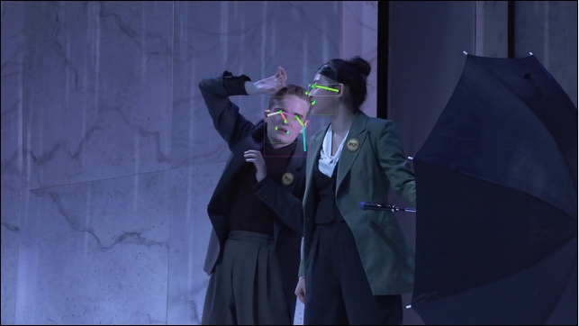 <strong>Open PifPaf</strong>  Temporal-convolutional 2D only, limited tracking

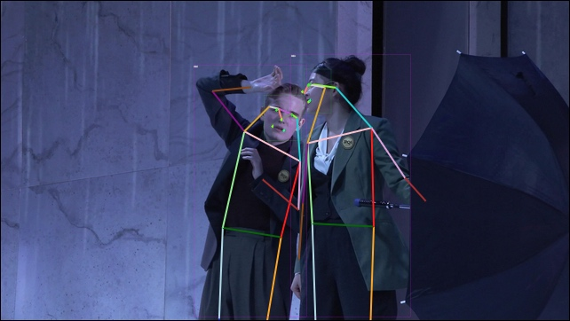 <strong>PHALP</strong> Transformers-based 3D, more robust to occlusion

:::
A fundamental aspect of this project is that we want to work with any theatrical performance recorded as a regular moving image -- so as a series of 2D frames without any built-in augmentation in the form of 3D data or motion capture dots or wearable intertial tracker telemetry (all of which would make pose estimation much easier). Working with regular moving images greatly increases the materials available, opening up basically the entire history of theater on film. However, computationally extracting accurate pose data from such recordings can be quite challenging, especially if they're "in the wild" recordings, whether made live on stage or in a studio, with multiple cameras, cuts, occlusion, shadows and so forth. In fact, this wasn't possible at all until about 2018, when advances in convolutional neural networks for computer vision led to the OpenPose project from CMU.

These convolutional approaches slowly improved during the following 5 years, and they worked well enough on recordings made in controlled environments and for things like TikTok videos with only one or two people who are almost entirely in the frame at all times. They struggled mightily however with in-the-wild videos such as the example shown here from the Stanford TAPS mainstage production of Julius Caesar from 2023 (directed by Michael!) and were even worse at estimating 3D coordinates and tracking multiple people in the shot.

So when we began this project, we were basically hoping that better models would come along to give us better data. And as has happens fairly often during the current era of AI research, we were in fact able to pull off the equivalent of jumping out of a plane and having someone toss a better parachute to us. This parachute came in the form a of a new generation of transformer-based models for computer vision, and more specifically via some great software tools for pose estimation and tracking from a research group across the Bay at UC Berkeley.

---

## A Breakthrough, Courtesy of the HAI Spring 2022 Conference

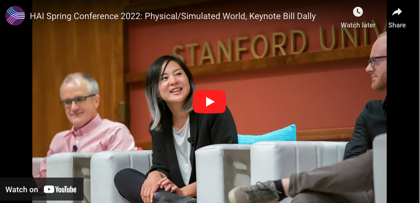 HAI Spring Conference, April 12, 2022 “Key Advances in AI”

:::
Which we learned about when attending the 2022 HAI Spring Conference! That's Angjoo Kanazawa, the senior faculty member overseeing most of these projects, along with Jitendra Malik at UC Berkeley.

---

## PHALP: Predicting Human Appearance, Location and Pose

Jathushan Rajasegaran, Georgios Pavlakos, Angjoo Kanazawa, Jitendra Malik. “Tracking People by Predicting 3D Appearance, Location & Pose.” arxiv.org/abs/2112.04477 (2021)

:::
The most crucially important of these tools is charmingly named PHALP -- you can see the acronym there -- and it achieves what is still state-of-the-art accuracy in pose estimation by interweaving the tasks of estimating human forms while also noting their appearance (that is, things like the colors on the clothes they're wearing) and tracking their trajectories over time in an estimated 3D space.

---

## Vision Transformers (ViT): Attention Comes to Pixel Patches

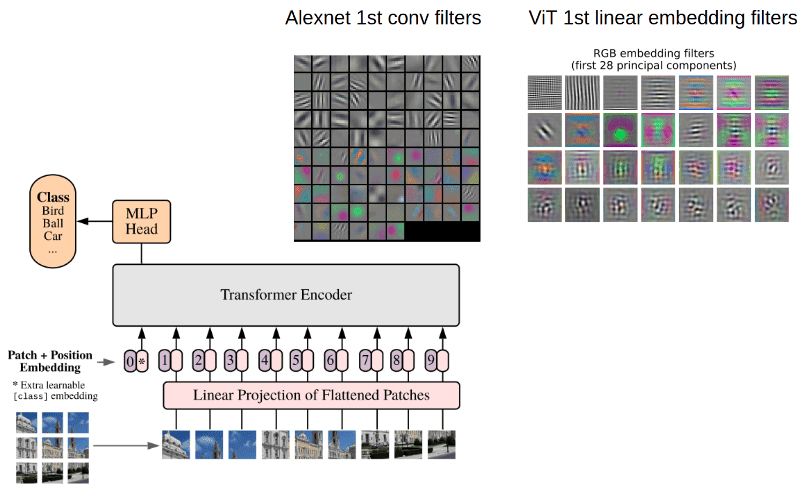 Alexey Dosovitskiy, et al. “An Image is Worth 16x16 Words: Transformers for Image Recognition at Scale.” In Proc. International Conference on Learning Representation 2021.

 Multi-headed self-attention, but with image patches instead of words 
<small>jalammar.github.io/illustrated-transformer/</small>

:::
I mentioned that these models derive much of their effectiveness from the Transformer architecture, which most of us first learned about via its applications to language models (and eventually to large language models) from its introduction in 2017, and especially the power of its "multi-headed self-attention" mechanism to encode complex semantic relationships between words. Vision transformers, which apply the same techniques to images, came along in 2021, and as you can see here, work by breaking up the image into long strings of 16x16-pixel patches that are essentially treated like words, after being passed through many multi-layer perceptrons.

---

## How PHALP Uses Transformers for Detection and Tracking

Shubham Goel, Georgios Pavlakos, Jathushan Rajasegaran, Angjoo Kanazawa, Jitendra Malik. “Humans in 4D: Reconstructing and Tracking Humans with Transformers.” arxiv.org/abs/2305.20091 (2023)

:::
Here are some further illustrations of how the PHALP tool combines not just vision transformers but also a separate temporally aware transformer to track poses over time, while modeling the positions of pose joints and surfaces, as well as the camera in the 3D environment.

---

## LART: Lagrangian Action Recognition with Tracking

Jathushan Rajasegaran, Georgios Pavlakos, Angjoo Kanazawa, Christoph Feichtenhofer, Jitendra Malik. “On the Benefits of 3D Pose and Tracking for Human Action Recognition.” arxiv.org/abs/2304.01199 (2023)

:::
The 3D pose tracking abilities of PHALP gave us much better pose data to use when applied to theater videos. We later augmented this with more data from a customized action recognition tool the same team built, named LART (they really like these one-syllable acronyms). The "Lagrangian" bit means that the tool considers each pose tracklet separately, producing distinct action descriptions (from a taxonomy of "atomic visual actions") for each pose in a shot. Compare this to other approaches which use similar models to describe an entire scene, rather than what each person in the scene is doing. Crucially, this software also produces a 60-element vector to describe every detected action, which provide much more computationally meaningful description of the actions than the simple labels from the taxonomy (things like "watch, stand, walk").

---

## Probabilistic View-Invariant (2D+) Pose Embeddings

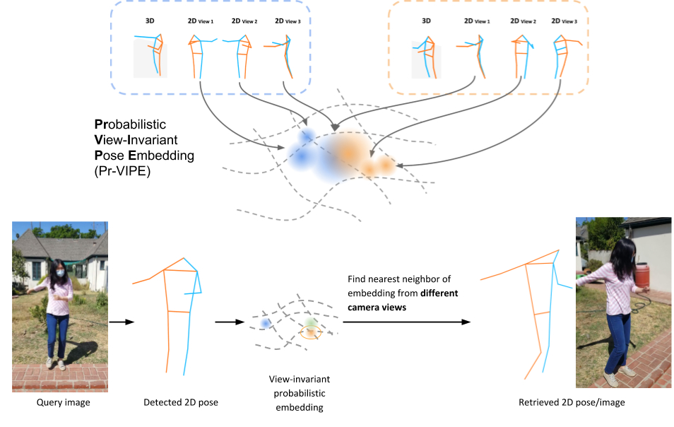

Sun, Jennifer J, Jiaping Zhao, Liang-Chieh Chen, Florian Schroff, Hartwig Adam and Ting Liu. “View-Invariant Probabilistic Embedding for Human Pose.” In Proceedings of the European Conference on Computer Vision, Springer, 2020, pp. 53-70.

:::
The final key tool that we applied to extract, analyze and compare pose data does not come from Berkeley, rather this is from Google and Caltech. It provides a trained model that can project the 13 X,Y coordinates of a pose in 2D into a probabilistic embedding space (which actually has 16 dimensions), that situates poses closer together if they are probably similar in their actual 3D representations. Note that we also get the esimated 3D coordinates of the poses from PHALP, but as we'll see later, sometimes this probabilistic embedding is more useful for analysis.

---

# The MIME Platform

---

## The MIME Platform

<section>

<svg class="spotlight" viewBox="0 0 1080 300" preserveAspectRatio="none">
  
  <defs>
    <mask id="spotlight-mask">
      <rect width="1080" height="300" fill="white" opacity=".6"/>
      <rect x="0" y="0" width="1080" height="300" fill="black"/>
    </mask>
  </defs>
  <rect width="1080" height="300" fill="#000" mask="url(#spotlight-mask)"/>
</svg>

---

## Platform Demonstration

<video id="platform-demo-video" controls muted src="assets/mime-hai-seminar-demo-video.mp4"></video>

---

# Results & Analysis

---

## The Test Corpus: Assembling Multiple Works per Director

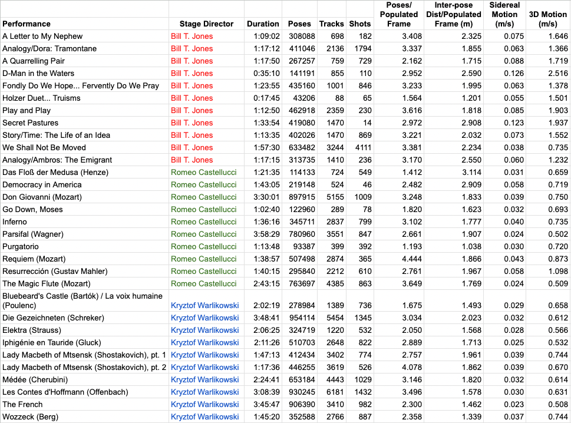

:::
To approach the question of what the pose, action, motion and position data we can extract from recordings via the MIME platform might tell us about how theater directors deploy these elements to produce specific effects that carry their own distinct stylistic signature, we focused on three high-profile, contemporary "auteur" directors: Bill T. Jones, Romeo Castellucci, and Krzysztof Warlikowski, selecting 10 or 11 performances each has directed during his career. We ran commercial or archival recordings of these performances through the PHALP pipeline unaltered, other than upscaling some of them to at least HD quality, because the models work better with high-resolution footage.

As you can see, this produced 10-20 hours of pose data per director. The table shows many of the summary statistics of the performances, which we'll discuss in more detail soon.

---

## Which Features Are Best for Differentiating between Directors?

Pose motion and distance statistics
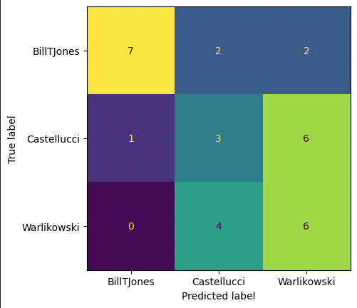

View-invariant pose embeddings
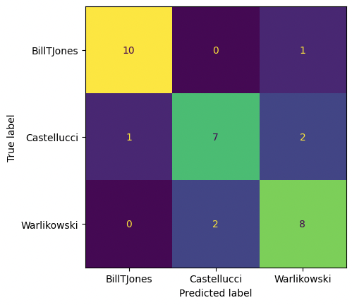

:::
We framed the computational approach to directorial style as a performance-to-director classification problem: from the derived pose, action, motion and distance data, which elements are most effective at predicting the correct stage director for a given performance? We began with “leave one out” (LOO) tests in which we assembled the average pose distance and motion features into a vector for each performance, then did the same for the view-invariant pose embedding vectors and action recognition vectors, and also the 3D “global orientation” pose keypoint coordinates, and compared these to aggregate vectors that averaged values from all of a director’s works except the held-out performance, initially matching them to the director's vector to which they had the highest cosine similarity.

Here you can see the resulting confusion matrices from some of these simple "leave one out" experiments. The basic pose and motion statistics were not as effective at differentiating works by Castellucci and Warlikowski as they were at telling the difference between Bill T. Jones and the other two, while the aggregated pose embeddings were more successful at differentiating the works of all three.

---

## Which Features Are Best for Differentiating between Directors?

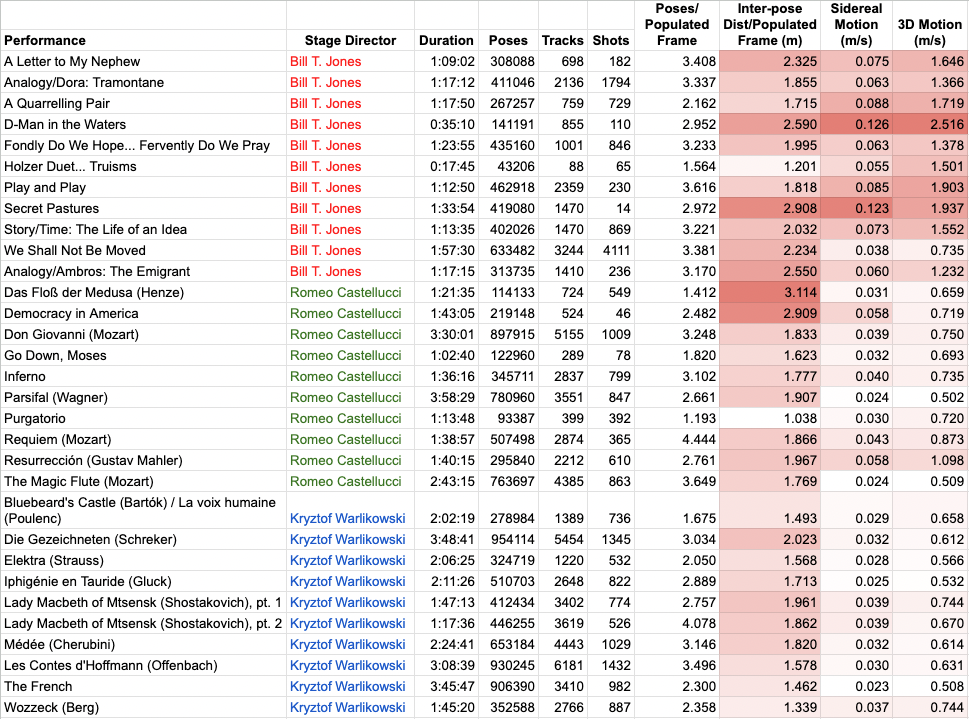

:::
Returning to the full table of performances, now with some colorization to point out recordings wih higher in-place or "sidereal" (relative to the backdrop) motion and inter-pose distances. As you can see, most are from Bill T. Jones, who primarily directs dance works, while the others tend to direct mostly operas and other more static forms of stage plays. So the motion and distance-based comparison may be better at clueing in to the difference in primary genres between the directors, while the pose embedding approach seems to be picking up something distinctive about each director's style. We'll look into what that might be in a minute.

---

## Which Features Are Best for Differentiating between Directors?

Body keypoint coords (3D)
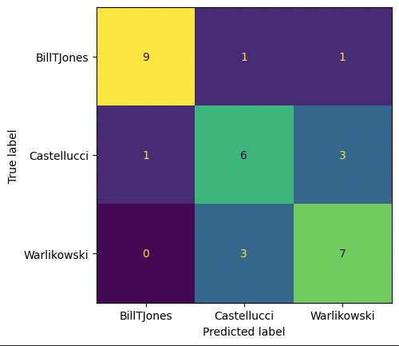

Action recognition embeddings
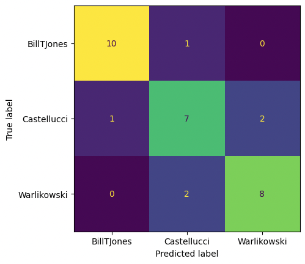

:::
Here are some further leave-one-out experiments with the 3D pose coordinates and action recognition vectors used as features. The action recognition embeddings do seem to be somewhat better than the 3D coordinates for telling the directors apart.

---

## Which Features Are Best for Differentiating between Directors?

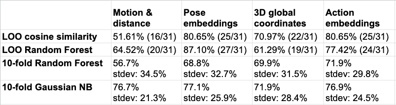

:::
The results of the leave-one-out tests are largely replicated in slightly analyses involving more sophisticated classification algorithms and using 10-fold cross-validation with different random seeds, when available, to try to get a better sense of how these approaches might do if the data set were larger. Remember that 33% accuracy would be expected by chance. It's interesting, however, that the Gaussian Naive Bayes classifier is nearly as good, and certainly within the margin of error, at differentiating between directors based on motion and distance statistics as the formerly dominant embedding approaches are with any approach. (Note that we tried many other classifiers here, including some fancy neural models, but their results were all in the ranges of the Random Forest and Gaussian Naive Bayes methods).

---

## Which Features Are Best for Differentiating between Directors?

Pose motion and distance
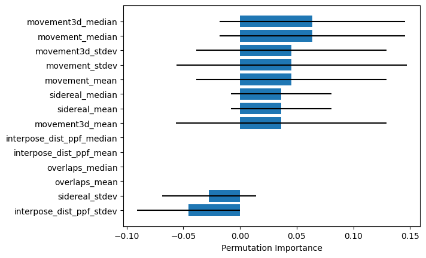

View-invariant pose embedding
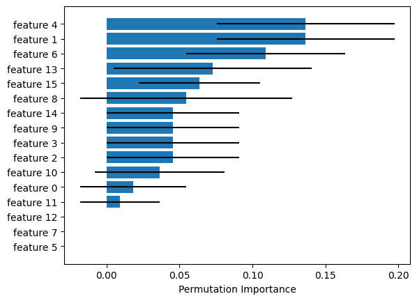

:::
To get at the question of exactly which elements of these feature sets the models found the most useful at differentiating between directors, we ran some feature importance tests (specifically with the Gaussian Naive Bayes model, as it generally performed the best). Although the error bars are large (again) due to the small set of performances to be classified, it seems that the average amount of motion in a video is one of the most powerful predictors of the director's identity, while the average distance between performers on stage is not so useful.

In the case of the embeddings, however, it's more difficult to determine what the salience of "feature 4" (out of 16) actually means for poses -- we'll show some initial steps we've taken to dig into this in a couple of slides.

---

## Which Features Are Best for Differentiating between Directors?

Body keypoint coords (3D)  
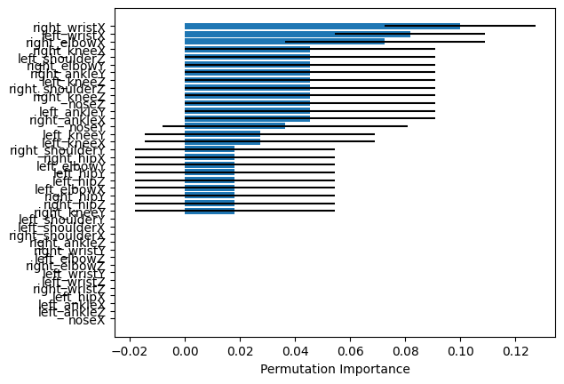

:::
And considering the 3D body keypoint coordinates, this plot might be a bit hard to read, but essentially the lateral positions of the right wrist, and then the left wrist as viewed from the "global" perspective (essentially from directly in front of the actor) was the most indicative of a director's style, followed by the lateral apsects of the right elbow and knee, then other aspects of the shoulders, knees, ankles, nose, with the hips being less important. The data are quite noisy here, but interestingly the right-handedness bias (due to up to 90% of the global population being right-handed) does seem to extend to the right side of the body more generally.

---

## Visualizing Directors' Pose "Repertoires"

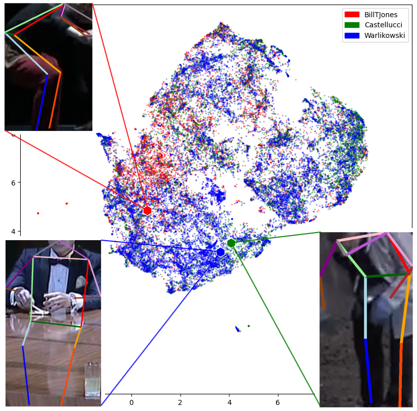

:::
To explore how the directors' pose "repertoires" might be distributed through the view-invariant pose embedding space, and hopefully get a better sense of what aspects of these embeddings were helping to differentiate the directors, we plotted a 1% sample of all of their pose embeddings into a 2D space via UMAP projection as color-coded dots. The larger hexagons represent each director's overall average pose embedding. Although we can't directly translate these averages into poses, we can search for the most similar poses in the entire data set thanks to MIME's powerful vector database, and we've shown some of those here in the callouts.

The callouts do seem to reveal useful insights, like the overall greater similarity between Castellucci’s and Warlikowski’s pose repertoires relative to Jones’s, and the tendencies of Jones to employ dramatically contorted poses, Castellucci to favor hunched-over standing postures, and Warlikowski to deploy figures in an active sitting position.

---

## Direct Comparison: Multiple Directors' Stagings of the Same Work

 Michael Hampe

 Romeo Castellucci

 Erik Söderblom

:::
Our final analytical experiment to date, which is still a work in progress, sort of inverts the previous approach and instead considers what MIME can reveal when comparing staging from seven different directors who are all directing the same work -- in this case the famous Mozart/Da Ponte opera Don Giovanni from 1787.

The screenshots below show some pose estimation output from the directors -- note that in every case this is the exact same scene, in the finale of Act I.

---

## Direct Comparison: Multiple Directors' Stagings of the Same Work

 Sven-Eric Bechtolf

 Damiano Michieletto

 Jean-François Sivadier

:::
The table above gives numerous derived statistics of the performances, colorized to highlight entries with greater degrees of movement, distance between actors, and overall deviation from the average pose and actions (aka "interest" as we saw in Simon's demo of the MIME interface). As the table is also ordered chronologically, it does seem to indicate a general tendency for performances to get more creative and/or "weird" in their stagings over time, as determined via pose and action estimation.

---

## Aligning Performances (by Music) to Get Average Pose "Consensus"

  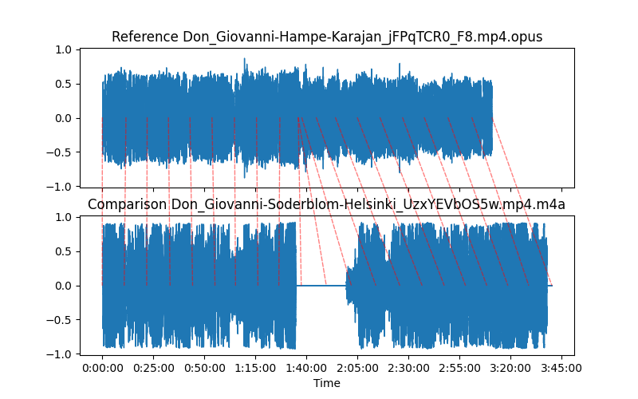
  
  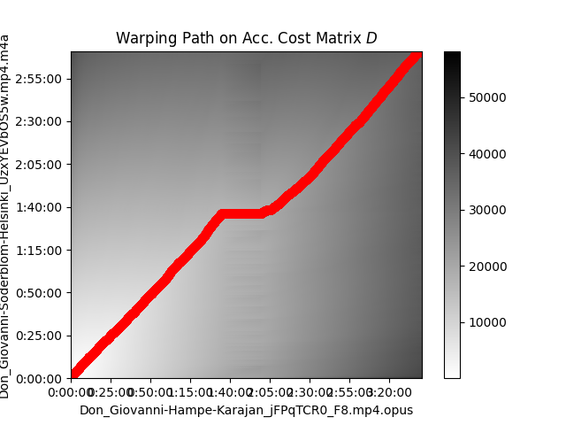

:::
Comparing the performances of Don Giovanni involved aligning all of the performances down to the sub-second level, specifically so that we could calculate the average poses and actions deployed at each moment of the opera -- representing what folklorists refer to as the "consensus form" or "tradition dominant" of a cultural expressive form -- and then calculate the degree to which each director's staging deviated from this consensus at each point.

Practically speaking, the easiest way to align the recordings, which only works because the work is an all-sung opera, involved using some old-fashioned signal processing/music information retrieval "AI" techniques to match the musical pitches heard at each point, then correcting for the significant differences in tempo, non-musical action, and the occasional omission of certain scenes via the dynamic time-warping algorithm.

---

## Comparing Each Director's Poses to the "Consensus" Average

<section data-background-iframe="assets/bokeh/dg_poem_comparison.html"
         data-background-interactive>
</section>

:::
As a final analytical output of the effort just described, we can plot the similarity of each of the 7 performances to the average pose "consensus" across the entire work (the dashed lines are scene and act boundaries). This is still a work in progress, but we can use this analysis to detect patterns such as certain scenes in which stagings are more likely to deviate from the consensus poses, and eventually use this to detect and highlight automatically where directors might use especially distinctive poses and actions. Stay tuned...

---

# Implications

:::
The computational analysis of pose and action in theatrical performances, as presented in this research, opens new avenues for understanding directorial styles and signatures. This is particularly significant because the creative contributions of directors are often overlooked or reduced to a single memorable moment or tableau. In reality, the staging of a theatrical production is a meticulous process that unfolds over weeks or even months, with the director crafting every moment of the performance. By leveraging this technology to examine their work in minute detail, we gain a more comprehensive view of their artistic vision. Furthermore, by mapping the differences between directors, we can more readily identify the common themes and stylistic elements that define their creative output, and separate out their unique contribution, divorced from the work of the performers, or the constraints of the particular text or physical space. By analyzing pose and movement across a director’s entire body of work, we can identify recurring patterns and trace the evolution of their style—elements that might remain elusive when examining individual performances in isolation. Additionally, this method enables objective comparisons between different directors’ interpretations of the same material, potentially revealing new dimensions of artistic expression and decision-making.
Moreover, the implications of this research extend far beyond theater studies. First, this methodology can be readily adapted to analyze performances in film, opera, dance, and other visual arts involving human movement. By quantifying patterns of pose and motion across different mediums, we may uncover new insights into the nature of performance itself, potentially bridging gaps between traditionally separate disciplines. Beyond the arts, this approach could also be applied to diverse fields, from analyzing political speeches to studying the biomechanics of physiology and sports.
However, it is crucial to acknowledge the ethical considerations and limitations inherent in this approach. The use of video analysis raises valid concerns particularly when applied to archival performances that do not have explicit consent of directors and performers. This presents a complex ethical landscape that requires careful navigation, including the development of clear guidelines and frameworks to ensure respectful and responsible use of such technologies.
From an analytical standpoint, we must also recognize the limitations of focusing solely on pose and action. Theater is a multifaceted art form, and while pose is a critical component, it represents only one thread in a rich tapestry that includes dialogue, set design, lighting, sound, and more. Without taking those other elements into account, we miss out on interpreting the While this computational analysis provides valuable insights, it should be viewed as a complement to, rather than a replacement for, traditional methods of artistic analysis. It offers a narrow but powerful lens through which to examine performance, enriching our understanding rather than supplanting it.
Finally, it is important to note that this computational approach cannot definitively determine directorial intent. The patterns observed may stem from conscious directorial choices, actor improvisations, or even unintentional recurring elements. As such, these findings should serve as a starting point for deeper, more nuanced investigations rather than as definitive conclusions.
In conclusion, while this research presents exciting possibilities for quantitative analysis in the arts, its true value lies in its potential to complement and enhance traditional scholarly approaches. By integrating computational methods with expert human interpretation, we can develop a more comprehensive understanding of theatrical performance and directorial style, ultimately enriching both academic discourse and artistic practice.

---

# Thank You&#x21;

