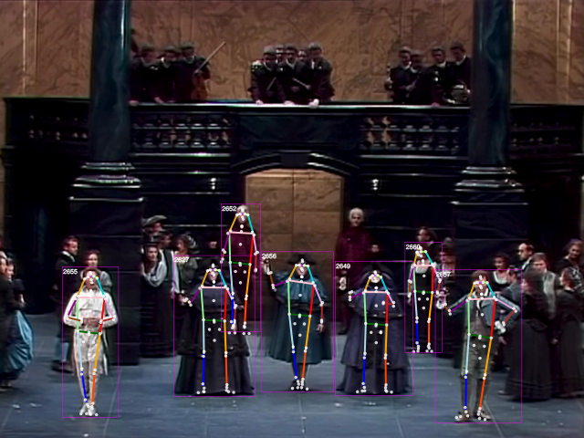
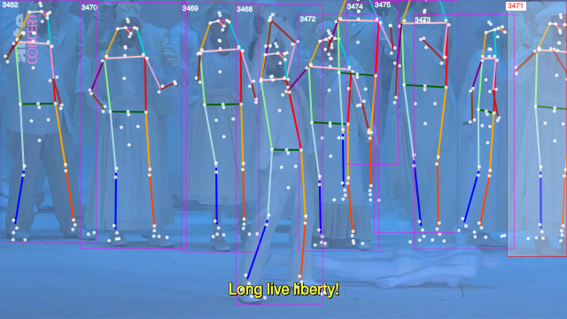
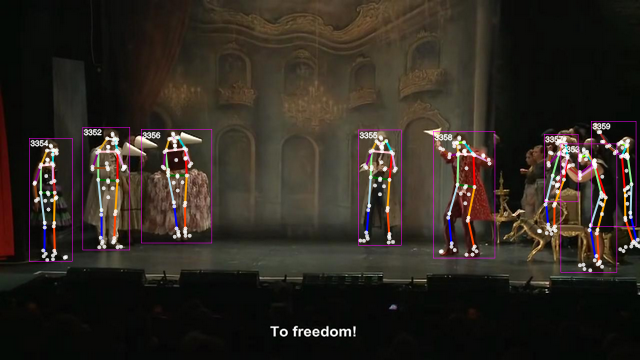
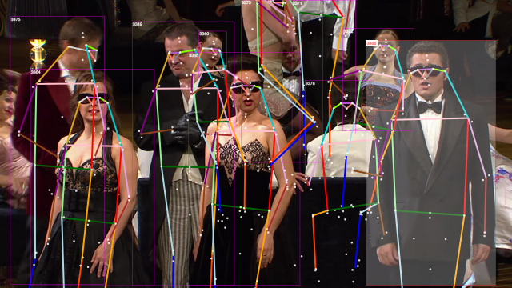
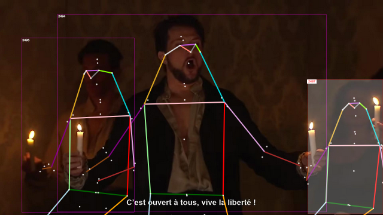

# Decoding Directorial Style: Using Pose and Action Estimation to Analyze Theater Performances

<!-- .slide: data-background-video="assets/vis_fondly_phalp_coco.mp4" -->
<!-- .slide: data-background-size="contain" -->
<!-- .slide: data-background-video-loop -->

---

## Introductions

 Michael Rau

 Peter Broadwell

 Simon Wiles

 Vijoy Abraham

---

## Defining the Problem (understanding pose in theater)

---

## A Breakthrough: Temporal-Convolutional vs. Transformer Models

 Open PifPaf  (Temporal-Convolutional)

 PHALP (Transformers)

---

## A Breakthrough, Courtesy of the HAI Spring 2022 Conference

 HAI Spring Conference, April 12, 2022 “Key Advances in AI”

---

## PHALP: Predicting Human Appearance, Location and Pose

Jathushan Rajasegaran, Georgios Pavlakos, Angjoo Kanazawa, Jitendra Malik. “Tracking People by Predicting 3D Appearance, Location & Pose.” arxiv.org/abs/2112.04477 (2021)

---

## Vision Transformers (ViT): Attention Comes to Pixel Patches

 Alexey Dosovitskiy, et al. “An Image is Worth 16x16 Words: Transformers for Image Recognition at Scale.” In Proc. International Conference on Learning Representation 2021.

 Multi-headed self-attention, but with image patches, rather than words 
(jalammar.github.io/illustrated-transformer/)

---

## How PHALP Uses Transformers for Detection and Tracking

Shubham Goel, Georgios Pavlakos, Jathushan Rajasegaran, Angjoo Kanazawa, Jitendra Malik. “Humans in 4D: Reconstructing and Tracking Humans with Transformers.” arxiv.org/abs/2305.20091 (2023)

---

## LART: Lagrangian Action Recognition with Tracking

Jathushan Rajasegaran, Georgios Pavlakos, Angjoo Kanazawa, Christoph Feichtenhofer, Jitendra Malik. “On the Benefits of 3D Pose and Tracking for Human Action Recognition.” arxiv.org/abs/2304.01199 (2023)

---

## View-Invariant ("2.5D") Pose Embeddings

Sun, Jennifer J, Jiaping Zhao, Liang-Chieh Chen, Florian Schroff, Hartwig Adam and Ting Liu. “View-Invariant Probabilistic Embedding for Human Pose.” In Proceedings of the European Conference on Computer Vision, Springer, 2020, pp. 53-70.

---

## Building the MIME Platform / Live Demo

---

## Results & Analysis

---

## The Test Corpus: Assembling Multiple Works per Director

---

## Which Features Are Best for Differentiating between Directors?

 Pose motion and distance statistics

 View-invariant pose embeddings

---

## Which Features Are Best for Differentiating between Directors?

---

## Which Features Are Best for Differentiating between Directors?

 Body keypoint coords (3D)

 Action recognition embeddings

---

## Which Features Are Best for Differentiating between Directors?

(Summary statistics of classification experiments go here)

---

## Which Features Are Best for Differentiating between Directors?

 Pose motion and distance

 View-invariant pose embedding elements

---

## Which Features Are Best for Differentiating between Directors?

Body keypoint coords (3D)

---

## Visualizing Directors' Pose "Repertoires"

---

## Direct Comparison: Multiple Directors' Stagings of the Same Work

 Michael Hampe

 Romeo Castellucci

 Erik Söderblom

---

## Direct Comparison: Multiple Directors' Stagings of the Same Work

 Sven-Erik Bechtolf

 Damiano Michieletto

 Jean-François Sivadier

---

## Aligning Performances (by Music) to Get Average Pose "Consensus"

  
  
  

---

## Comparing Each Director's Poses to the "Consensus" Average

<section data-background-iframe="assets/bokeh/dg_poem_comparison.html"
         data-background-interactive>
</section>

---

## Implications and Future Directions

---

## Questions & Discussion

---

# Thank You

